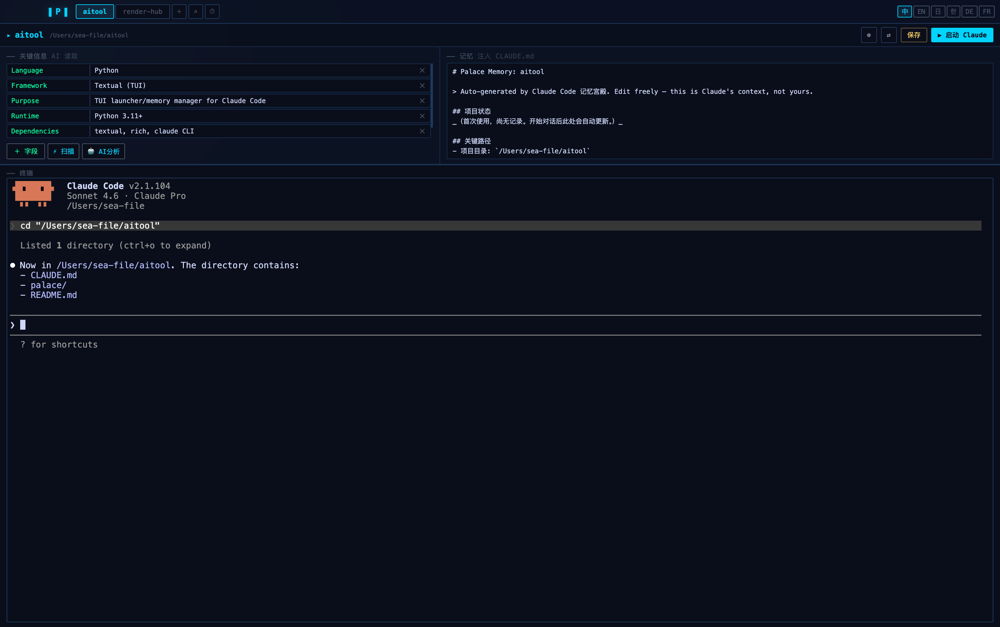

<div align="center">

# 🏛 Palace

**Claude Code Memory Palace · Claude Code 记忆宫殿**

Give Claude a photographic memory for every project.  
让每个项目的 Claude，都记得你们之间的一切。

[](LICENSE)
[](https://electronjs.org)
[](https://claude.ai/code)
[](https://github.com/Aishuomeng/palace)
[](https://nodejs.org)

</div>

---

<div align="center">

</div>

---

## The Problem · 问题

Every Claude Code session starts **cold**. You spend the first 5 minutes re-explaining:

- What the project does
- Where you left off last time
- What decisions were already made
- What's currently broken and why

**This is wasteful. Palace fixes it.**

每次打开 Claude Code，都要重新解释一遍：项目是什么、做到哪了、上次决定了什么、现在哪里有问题。  
**Palace 终结了这个问题。**

---

## How It Works · 工作原理

```
You fill in memory  →  Click ▶ Launch  →  Palace injects into CLAUDE.md  →  Claude starts knowing everything
填写项目记忆         →  点击 ▶ 启动    →  自动注入到 CLAUDE.md            →  Claude 一开口就全懂
```

Palace writes a structured block into your project's `CLAUDE.md` before launching Claude:

```markdown
<!-- PALACE:START -->
## Project Fields (from Palace)
- **Framework**: Next.js + TypeScript
- **Database**: PostgreSQL
- **OPENAI_API_KEY**: (your key)

## 项目状态
- 登录模块已完成，正在开发支付流程

## 待办
1. 实现 /api/webhook/stripe
2. 添加邮件通知
<!-- PALACE:END -->
```

Claude reads this automatically at startup. No re-explanation needed.  
Claude 启动时自动读取，无需任何解释。

---

## Features · 功能

| | Feature | 功能描述 |
|--|---------|---------|
| 📂 | **Multi-project manager** | 多项目统一管理，Tab 切换 |
| 🧠 | **Persistent memory per project** | 每个项目独立记忆，互不干扰 |
| 🔑 | **Key fields** | API key、框架、数据库等关键信息一并注入 |
| ⚡ | **Local auto-scan** | 自动识别技术栈（package.json / Cargo.toml / go.mod…） |
| 🤖 | **AI deep analysis** | 一键让 Claude 分析项目并填写字段 |
| 🖥️ | **Built-in terminal** | 内置 xterm.js 终端，无需切换窗口 |
| ⏱️ | **Session timeline** | 每次启动自动存档，随时查看历史 |
| 🌏 | **6 languages** | 中文 / English / 日本語 / 한국어 / Deutsch / Français |
| 🎨 | **Dark glassmorphism UI** | 暗色玻璃拟态界面 |

---

## Installation · 安装

### Prerequisites · 环境要求

- **macOS** (Apple Silicon or Intel)
- **Node.js 18+** — [Download](https://nodejs.org)
- **Claude Code CLI** — [Install](https://claude.ai/code), must be logged in

### Install · 安装步骤

```bash
# 1. Clone the repo · 克隆仓库
git clone https://github.com/Aishuomeng/palace.git
cd palace/app

# 2. Install dependencies · 安装依赖
# (automatically downloads Electron and rebuilds native modules)
npm install

# 3. Launch · 启动
npm start
```

> **Note for China users · 国内用户注意**  
> `postinstall` 已自动配置 npmmirror 镜像加速 Electron 下载，无需手动设置。

### If `node-pty` fails to build · 如果 node-pty 编译失败

```bash
npm run rebuild
```

---

## Usage · 使用说明

### Step 1 — Auth · 授权

Palace automatically detects if Claude Code is installed and authenticated.  
自动检测 Claude Code 安装和登录状态。

- ✅ Already logged in → auto-proceeds to project picker  
- ❌ Not logged in → complete login in the built-in terminal

### Step 2 — Add a project · 添加项目

Three ways:  
三种方式：

1. **＋ New** — manually enter project name and path  
   手动输入项目名和路径

2. **⌕ Scan** — scan a directory, batch import all git/Claude projects  
   扫描目录，批量导入所有含 `.git` 或 `CLAUDE.md` 的项目

3. **Auto-fill** — after adding, Palace auto-scans the tech stack  
   添加后自动扫描技术栈并填写字段

### Step 3 — Fill memory · 填写记忆

Left column: **Key fields** — structured data (framework, API keys, database…)  
左栏：**关键字段** — 结构化信息（框架、API key、数据库…）

Right column: **Memory** — free-form context for Claude  
右栏：**记忆** — 给 Claude 的自由文本上下文

```
# 项目状态
- 支付模块开发中，Stripe 集成已完成 80%

# 待办
- [ ] 测试 webhook
- [ ] 部署到生产环境

# 注意事项
- 使用 pnpm，不要用 npm
- 数据库 migration 需要先备份
```

### Step 4 — Launch Claude · 启动 Claude

Click **▶ 启动 Claude** or press `⌘ Enter`.

Palace will:
1. Save your project + memory
2. Inject everything into `CLAUDE.md`
3. Open a terminal and run `claude`

点击 **▶ 启动 Claude** 或按 `⌘ Enter`。  
Palace 自动保存 → 注入 CLAUDE.md → 在内置终端启动 `claude`。

---

## Keyboard Shortcuts · 快捷键

| Shortcut | Action |
|----------|--------|
| `⌘ Enter` | Launch Claude · 启动 Claude |
| `⌘ S` | Save project · 保存 |
| `Esc` | Close modal · 关闭弹窗 |
| Right-click terminal | Context menu (explain / fix / copy) · 右键菜单 |

---

## Data Storage · 数据存储

All Palace data is stored locally in `~/.palace/`:

```
~/.palace/
├── {project-id}/
│   ├── meta.json        # name, path, fields, last_active
│   ├── memory.md        # the memory text
│   └── sessions/        # launch history (last 20)
│       └── 2026-04-13T...json
```

Nothing is sent to any server. Everything stays on your machine.  
所有数据存储在本地，不上传任何服务器。

---

## Project Structure · 项目结构

```
palace/
├── app/                      # Electron desktop app
│   ├── main.js               # Main process: IPC, PTY, file I/O
│   ├── preload.js            # Context bridge (renderer ↔ main)
│   └── renderer/
│       ├── index.html        # App skeleton
│       ├── app.js            # All frontend logic
│       ├── style.css         # Dark glassmorphism theme
│       └── i18n.js           # 6-language translations
└── src/palace/               # Legacy Python TUI (archived)
```

---

## Contributing · 贡献

Issues and PRs welcome!  
欢迎提 Issue 和 PR！

If Palace saves you time, please give it a ⭐  
如果 Palace 对你有帮助，请点 ⭐ 支持！

---

## License

MIT © [Aishuomeng](https://github.com/Aishuomeng/palace)

---

<div align="center">

**Built for developers who use Claude Code every day.**  
**为每天使用 Claude Code 的开发者而生。**

</div>
